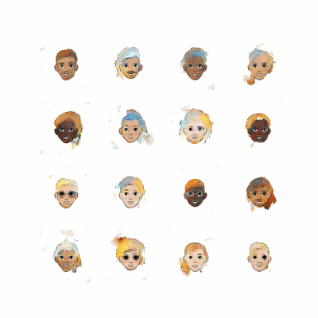

# Generating Cartoon Faces with GAN

Welcome to the **Generating Cartoon Faces** project! This repository contains a deep learning model that uses GANs (Generative Adversarial Networks) to generate cartoon-style faces.

## **Project Overview**

This project leverages a GAN architecture to create cartoon faces from scratch. The model is trained on a dataset of cartoon faces and is capable of producing new, unique faces that mimic the style and features of the training data.

## **Key Features**

- **Generative Model**: Utilizes GANs to generate high-quality cartoon faces.
- **Scalable**: Easily train the model on different datasets or adjust the model to create faces in various artistic styles.
- **Sample Outputs**: View examples of generated cartoon faces in the **Sample Outputs** section below.

## **Sample Outputs**

** Model Progress in 30 epochs **

** images created after each 5 epochs seperately**

