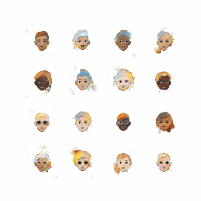
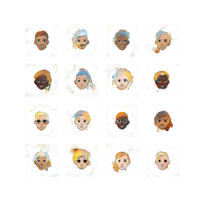
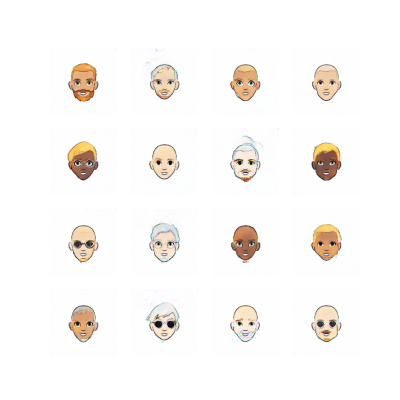
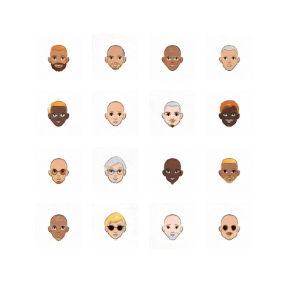
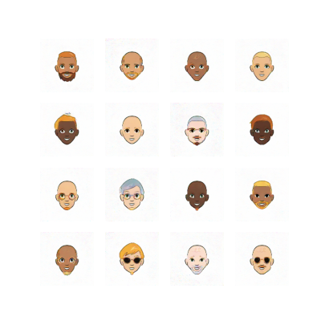
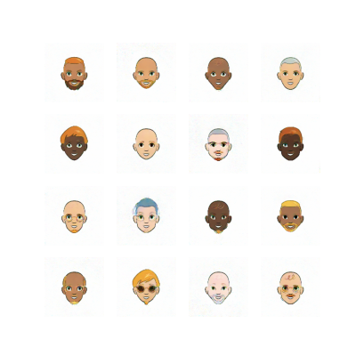
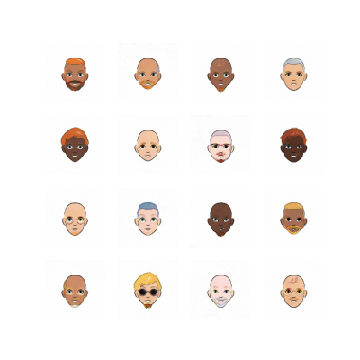

# Generating Cartoon Faces with GAN

Welcome to the **Generating Cartoon Faces** project! This repository contains a deep learning model that uses GANs (Generative Adversarial Networks) to generate cartoon-style faces.

## **Project Overview**

This project leverages a GAN architecture to create cartoon faces from scratch. The model is trained on a dataset of cartoon faces and is capable of producing new, unique faces that mimic the style and features of the training data.

## **Key Features**

- **Generative Model**: Utilizes GANs to generate high-quality cartoon faces.
- **Scalable**: Easily train the model on different datasets or adjust the model to create faces in various artistic styles.
- **Sample Outputs**: View examples of generated cartoon faces in the **Sample Outputs** section below.

## **Sample Outputs**

### **Model Progress in 30 Epochs**

### **Images Created After Each 5 Epochs**

<table>
  <tr>
    <td><b>After 5 Epochs</b></td>
    <td><b>After 10 Epochs</b></td>
  </tr>
  <tr>
    <td></td>
    <td></td>
  </tr>
  <tr>
    <td><b>After 15 Epochs</b></td>
    <td><b>After 20 Epochs</b></td>
  </tr>
  <tr>
    <td></td>
    <td></td>
  </tr>
  <tr>
    <td><b>After 25 Epochs</b></td>
    <td><b>After 30 Epochs</b></td>
  </tr>
  <tr>
    <td></td>
    <td></td>
  </tr>
</table>
