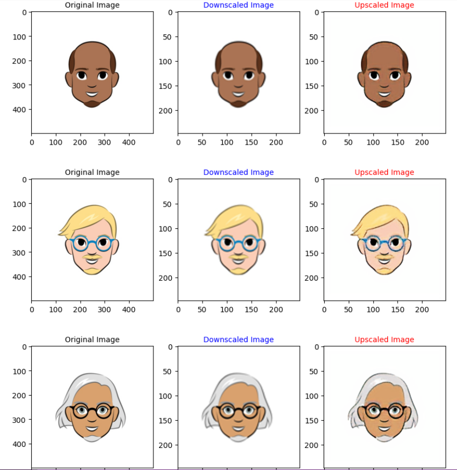

# Image Enhancement with Autoencoder

Welcome to the **Image Enhancement** project! This repository provides tools to enhance image quality using a deep learning-based autoencoder.

## **Project Overview**

This project utilizes an autoencoder model to improve the resolution and clarity of images. The model has been trained to recognize and enhance various aspects of image quality, making it ideal for applications requiring sharper and more detailed visuals.

## **Key Features**

- **Deep Learning Model**: Uses a convolutional autoencoder architecture to enhance image quality.
- **User-Friendly**: Easy to run with straightforward commands.
- **Flexible**: The model can be fine-tuned or adapted for specific image enhancement tasks.
- **Sample Outputs**: Check out some examples of images before and after enhancement in the **Sample Outputs** section below.

## **Sample Outputs** 

