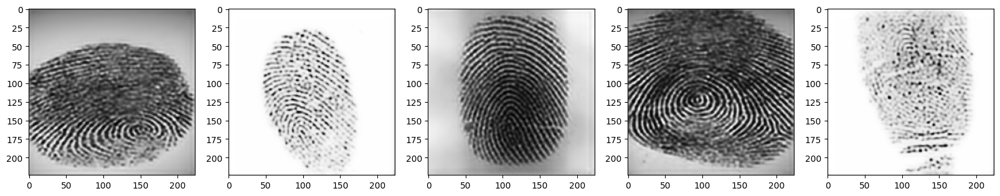
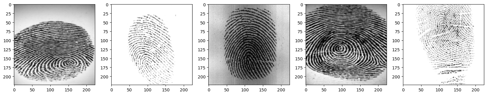

# Reconstructing Fingerprint Images Using Autoencoder

Welcome to the **Reconstructing Fingerprint Images** project! This repository showcases the use of an autoencoder to reconstruct and enhance fingerprint images, which can be crucial in various applications such as forensic analysis and biometric authentication.

## **Project Overview**

This project leverages a deep learning model based on autoencoder architecture to reconstruct fingerprint images. The goal is to improve the clarity and accuracy of fingerprint images by learning an efficient encoding of the original images and then decoding them to reconstruct high-quality outputs.

Autoencoders are particularly well-suited for this task as they can effectively learn the underlying structure of fingerprint patterns, making it possible to recover fine details even in degraded or partially missing images.

## **Key Features**

- **Autoencoder Architecture**: Uses a convolutional autoencoder to reconstruct and enhance fingerprint images.
- **Improvement in Quality**: The model can enhance low-quality or corrupted fingerprint images, making them more useful for identification and analysis.
- **Sample Outputs**: Explore reconstructed fingerprint images in the **Sample Outputs** section below.

## **Sample Outputs** 

**Reconstructed**

**Ground Truth**

